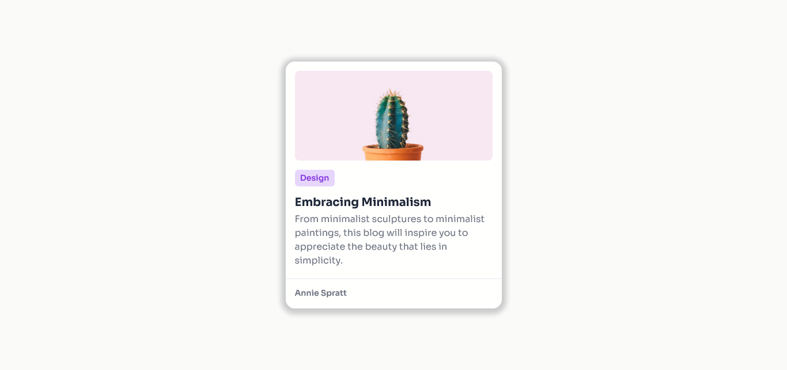

## MINIMAL BLOG CARD

## Le challenge

Création du projet : Minimal blog card en HTML5 et CSS3.

## Démonstration

Lien vers le projet : https://aperbet56.github.io/minimal_blog_card/

## Projet développé avec

- Utilisation des balises sémantiques HTML5
- CSS3
- Variables CSS
- Commentaires HTML
- Commentaires CSS
- Flexbox
- Animation CSS (transition)
- Desktop first
- Page web responsive
- Utilisation d'un normaliseur : le fichier normalize.css
- Importation de la police "Sora"
